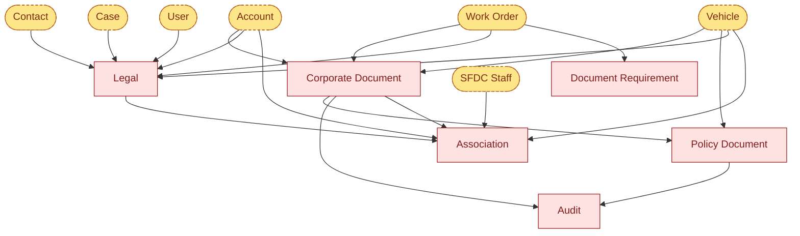

# PPP Salesforce — Compliance Architecture

Corporate documents, policy documents, audits, legal matters, and the Association junction that ties them to staff/vehicles/accounts.

← Back to [main map](architecture_main.md) · sibling: [Marketing & Geography](architecture_marketing_geo.md)

---

## Compliance objects & connections

`Corporate_Document__c` is the master library (insurance certs, contractor agreements, etc.). `Policy_Document__c` is an internal HR/safety policy parented to a Corporate Document. `Audit__c` is a periodic review of either. `Legal__c` is the master matter record with broad fan-in. `Association__c` is the junction that links Corporate Documents and Legal matters to the parties / assets they cover. `DocumentRequirement__c` flags required docs per Work Order.

---

## Cross-map links

Everything dashed/amber above lives on the [main map](architecture_main.md):
- `Account`, `Contact`, `User`, `Work Order`, `Case` → Sales Pipeline / Service Delivery clusters
- `Vehicle`, `SFDC Staff` → Fleet & Quota cluster
