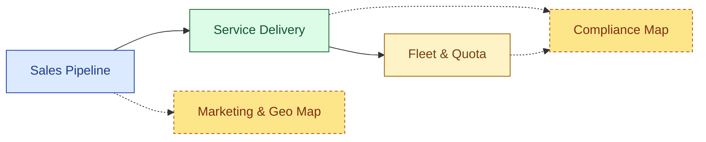
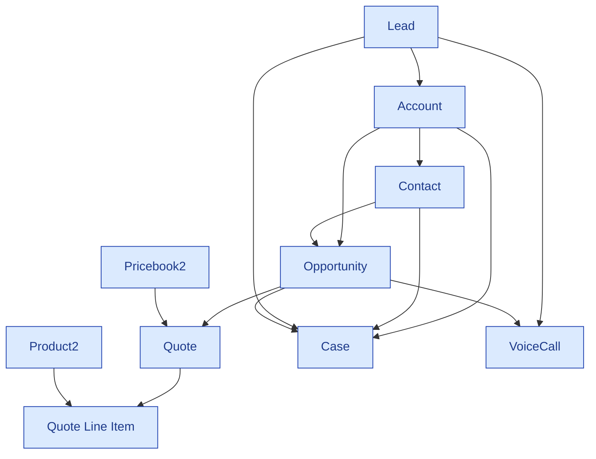
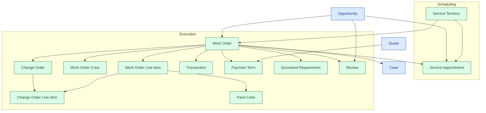
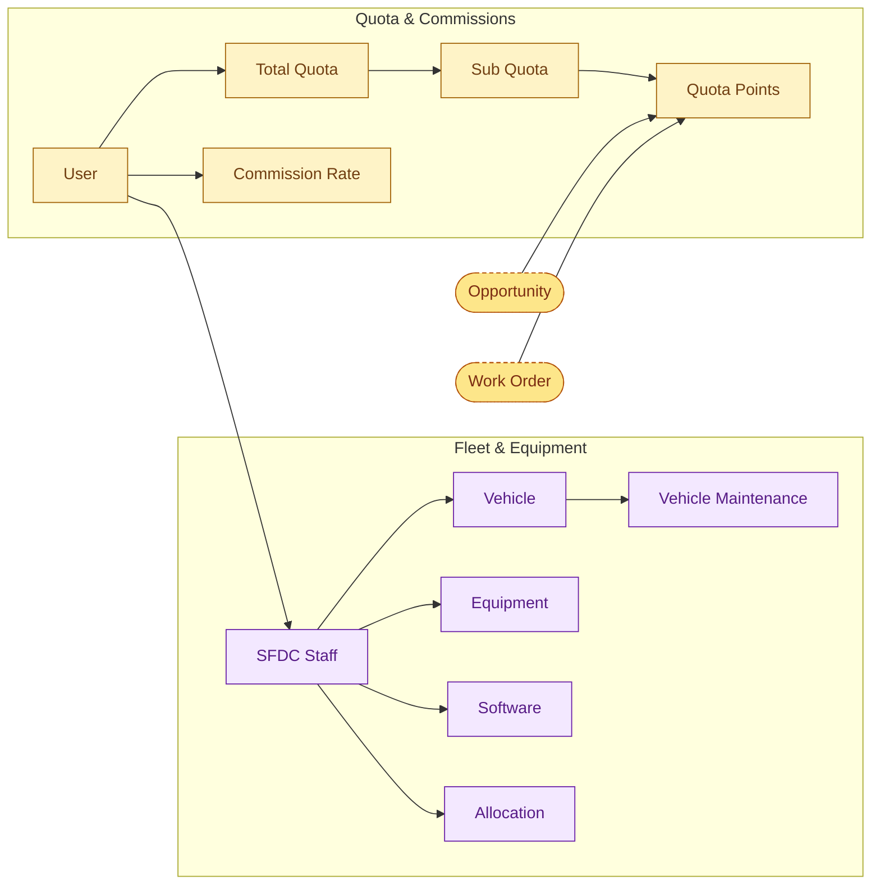

# PPP Salesforce — Main Architecture Map

Visual map of regularly-used Salesforce objects and how they connect. Based on the 2026-05-11 production snapshot dictionary.

**Sub-maps:**
- [Compliance map](architecture_compliance.md) — Corporate Documents, Policy Documents, Legal, Audits, Association junction, Document Requirement
- [Marketing & Geography map](architecture_marketing_geo.md) — Ad spend, Marketing Profile, Zip Code, standalone profile records

---

## Overview

---

## Sales Pipeline

Lead converts into Account + Contact + Opportunity; quotes flow off the opportunity. Voice calls and cases hang off the customer-facing side.

---

## Service Delivery

The Opportunity → Work Order spine. Service Appointment branches off early (near Opportunity); Work Order owns everything else — line items, crews, change orders, paint, transactions, payment terms, document requirements, reviews.

---

## Fleet & Quota

Two side-by-side neighborhoods that share `User` as the bridge: each User has Total Quota + Commission Rate (left), and an SFDC Staff record that owns their assigned Vehicle / Equipment / Software / Allocation (right). Quota Points are populated from won Opportunities and Work Orders.

> **Schema trap:** `SubQuota__c.CurrentUserId__c` is the *viewer's* User Id, not the rep. Use `TotalQuota__r.User__c` for actual rep attribution.

---

## Cross-map links

| From | To |
|---|---|
| `Account` | [Compliance → Corporate_Document, Legal, Association](architecture_compliance.md) |
| `Vehicle__c` | [Compliance → Legal, Corporate_Document, Policy_Document, Association](architecture_compliance.md) |
| `Work Order` | [Compliance → Corporate_Document, Legal, DocumentRequirement](architecture_compliance.md) |
| `SFDC Staff` | [Compliance → Association](architecture_compliance.md) |
| `Review` | [Marketing → Marketing Profile](architecture_marketing_geo.md) (MP → Review) |
| `Lead`, `Opportunity` | [Marketing → AdCostDetail, Zip Code](architecture_marketing_geo.md) |
| `Account`, `Service Territory` | [Marketing → AdCostDetail, Zip Code](architecture_marketing_geo.md) |
