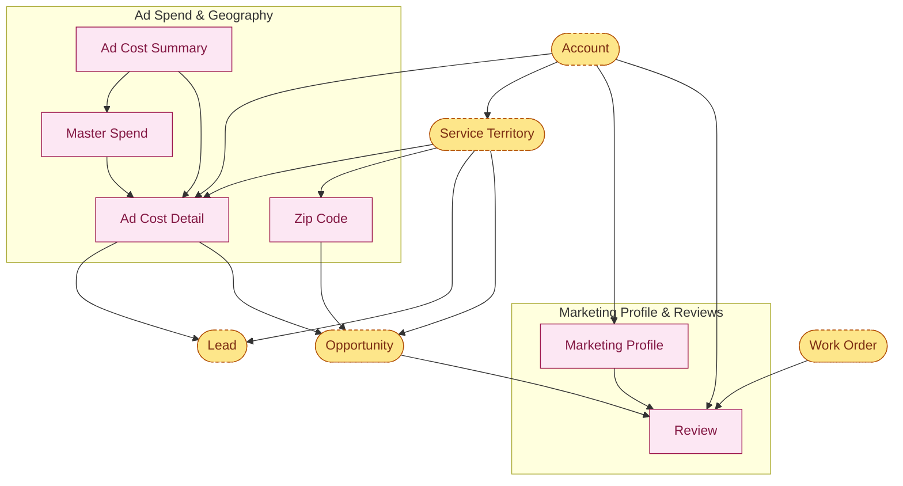

# PPP Salesforce — Marketing & Geography Architecture

Single combined map: Account is the root. Ad spend roll-up (with Zip Code between Service Territory and Lead/Opportunity) is the main branch; Marketing Profile → Review is the side branch.

← Back to [main map](architecture_main.md) · sibling: [Compliance](architecture_compliance.md)

---

## Marketing & Geography map

---

## Standalone reference records

These have no FK relationships in the dictionary — they're reference tables joined by Name or referenced via reporting, not lookups:
- `Angi_Profile__c` — Angi lead-source profile (id + name)
- `HomeAdvisor_Profile__c` — HomeAdvisor lead-source profile (id + name)
- `Region__c` — region master list

---

## Cross-map links

Everything dashed/amber on the chart lives on the [main map](architecture_main.md):
- `Account`, `Lead`, `Opportunity` → Sales Pipeline
- `Service Territory`, `Work Order` → Service Delivery cluster
